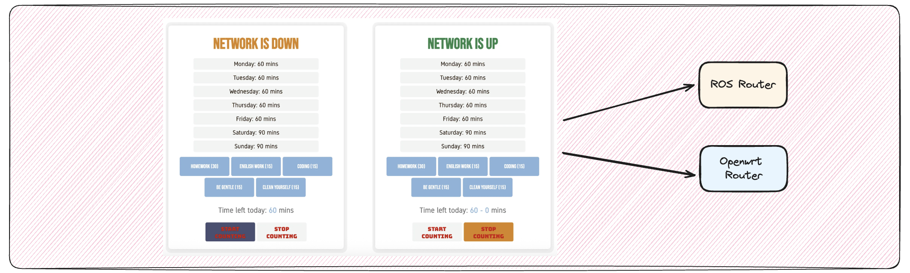

# Kid Control

A Python/Flask-based home network and time management system for device and rule control, with OpenWRT integration and a modern web UI.



## Features

- Device management and reconnection via OpenWRT/SSH
- Time-based network access control for kids
- Configurable daily time limits and rest periods
- Web UI for configuration and status
- SVG favicon and improved UI/UX
- Robust logging and error handling
- Background thread for periodic time checks

## Requirements

- Python 3.7+
- OpenWRT router (for device control)
- SSH access to router
- All Python dependencies are managed in `pyproject.toml`

## Setup

1. Clone this repository.
2. Install dependencies using [uv](https://github.com/astral-sh/uv) (fast Python package manager):
   ```bash
   uv sync
   ```
3. Configure your router and device info in `config.py` and `data.json`.
4. Place your SVG favicon in `static/mitang.svg`.

## Running

```bash
uv run app.py
```

- The web UI will be available at `http://<your-server>:5000/`
- For production, run with `debug=False` (default).

## Usage

- Visit `/` for the main dashboard.
- Use `/edit` to configure time limits and devices.
- Device reconnection and rule status are managed automatically.
- Password-protected actions are available for parents.

## Logging

- Logs are written to the console and/or files as configured in `config.py`.
- All major actions and errors are logged for troubleshooting.

## Customization

- Edit `config.py` for network and device settings.
- Edit `templates/` for UI changes.
- Edit `router_control.py` and `time_control.py` for backend logic.

## License

MIT License
